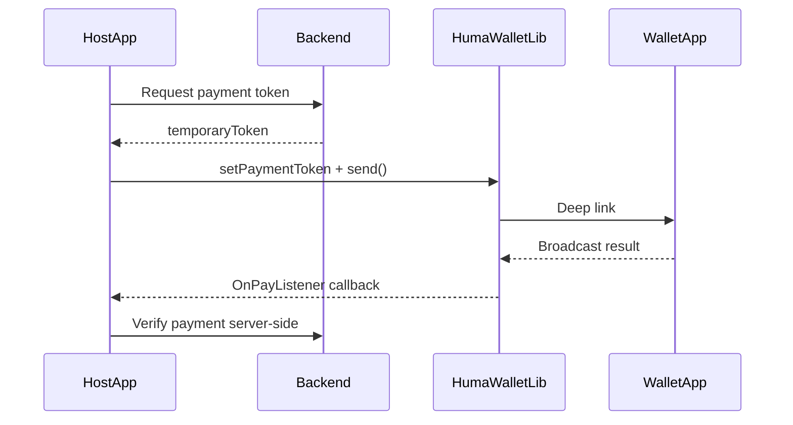

# HumaWalletLib

Android SDK for launching Huma/Done wallet payments from third-party apps and receiving the result via broadcast.

The library exposes a single public class: `ir.huma.humawallet.lib.HumaWallet`.

## How it works

1. Your backend requests a temporary payment token from the Huma Wallet Service.
2. Your app passes that token to `HumaWallet` and calls `send()`.
3. The SDK opens the wallet app (Done or Huma Store) via deep link.
4. When payment completes, the wallet app sends a broadcast; the SDK delivers the result to your `OnPayListener`.
5. **Verify payment success on your server** in `onPayComplete` — do not rely on the client callback alone.




## Requirements

- Android minSdk 24, compileSdk 33, AGP **7.0+**, Kotlin **1.9.x**, minSdk **24**, JDK **17**
- Done app (`ir.huma.android.launcher`) or Huma Store (`ir.huma.humastore`) installed on the device
- Backend integrated with Huma Wallet Service for token generation

## Installation

### Gradle module

```kotlin
// settings.gradle.kts
dependencyResolutionManagement {
    repositories {
        mavenCentral()
        maven { url 'https://jitpack.io' }
    }
}
// app/build.gradle.kts
dependencies {
    implementation("com.github.Montazar1375:HumaWalletLib:-version-")
}
```

## Usage

```kotlin
HumaWallet(this)
    .setPaymentToken(temporaryTokenFromServer)
    .setOnPayListener(object : HumaWallet.OnPayListener {
        override fun onPayComplete(code: String?) { /* verify */ }
        override fun onPayFail(message: String?) { /* handle */ }
    })
    .send()
```

Call `unregister()` in `onDestroy()` to avoid leaking the broadcast receiver:

```java
@Override
protected void onDestroy() {
    if (wallet != null) {
        wallet.unregister();
    }
    super.onDestroy();
}
```

## API


| Method                       | Description                                               |
| ---------------------------- | --------------------------------------------------------- |
| `HumaWallet(activity)`       | Create instance with host Activity                        |
| `setPaymentToken(token)`     | Required — server-issued token                            |
| `setOnPayListener(listener)` | Required before `send()`                                  |
| `setPaymentType(type)`       | Optional — legacy wallet routing (`FAST`, `BNPL`, `NONE`) |
| `setFastPayment(isFast)`     | Optional — legacy wallet only                             |
| `send()`                     | Launch wallet payment flow                                |
| `unregister()`               | Unregister broadcast receiver                             |


| Callback              | When                |
| --------------------- | ------------------- |
| `onPayComplete(code)` | Payment succeeded   |
| `onPayFail(message)`  | Cancelled or failed |


## Wallet selection

The SDK picks a wallet automatically:

1. **Done app** (`ir.huma.android.launcher`) — if installed with `versionCode >= 400`
2. **Huma Store** — if `ir.huma.humastore` is installed
3. Otherwise — shows a toast asking the user to install the latest Done/Huma app

The library manifest includes the required `<queries>` for Android 11+ package visibility. No extra manifest changes are needed in your host app.